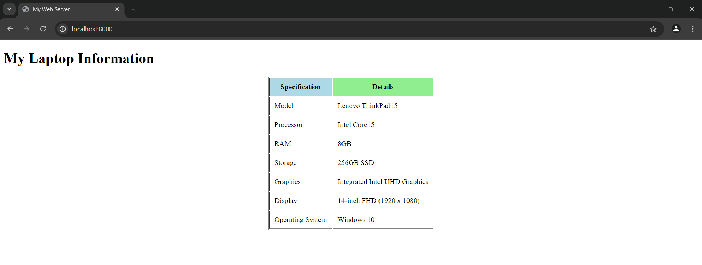

# EX01 Developing a Simple Webserver
## Date: 24.10.2024

## AIM:
To develop a simple webserver to serve html pages and display the configuration details of laptop.

## DESIGN STEPS:
### Step 1: 
HTML content creation.

### Step 2:
Design of webserver workflow.

### Step 3:
Implementation using Python code.

### Step 4:
Serving the HTML pages.

### Step 5:
Testing the webserver.

## PROGRAM:
'''
from http.server import HTTPServer,BaseHTTPRequestHandler

content='''
<!doctype html>
<html>
<head>
<title> My Web Server</title>
</head>
<body>
<h1>My Laptop Information</h1>
   <table border="1" cellpadding="10" align="center">
        <tr>
            <th bgcolor="lightblue">Specification</th>
            <th bgcolor="lightpink">Details</th>
        </tr>
        <tr>
            <td>Model</td>
            <td>Lenovo ThinkPad i5</td>
        </tr>
        <tr>
            <td>Processor</td>
            <td>Intel Core i5</td>
        </tr>
        <tr>
            <td>RAM</td>
            <td>8GB</td>
        </tr>
        <tr>
            <td>Storage</td>
            <td>256GB SSD</td>
        </tr>
        <tr>
            <td>Graphics</td>
            <td>Integrated Intel UHD Graphics</td>
        </tr>
        <tr>
            <td>Display</td>
            <td>14-inch FHD (1920 x 1080)</td>
        </tr>
        <tr>
            <td>Operating System</td>
            <td>Windows 10</td>
        </tr>
    </table>
</body>
</html>
'''

class MyServer(BaseHTTPRequestHandler):
    def do_GET(self):
        print("Get request received...")
        self.send_response(200) 
        self.send_header("content-type", "text/html")       
        self.end_headers()
        self.wfile.write(content.encode())

print("This is my webserver") 
server_address =('',8000)
httpd = HTTPServer(server_address,MyServer)
httpd.serve_forever()
'''

## OUTPUT: 

## RESULT:
The program for implementing simple webserver is executed successfully.
